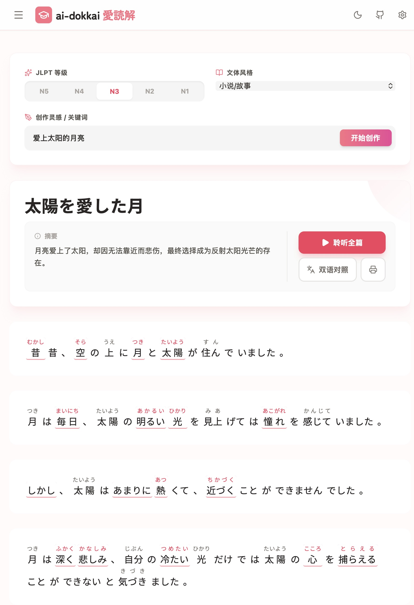
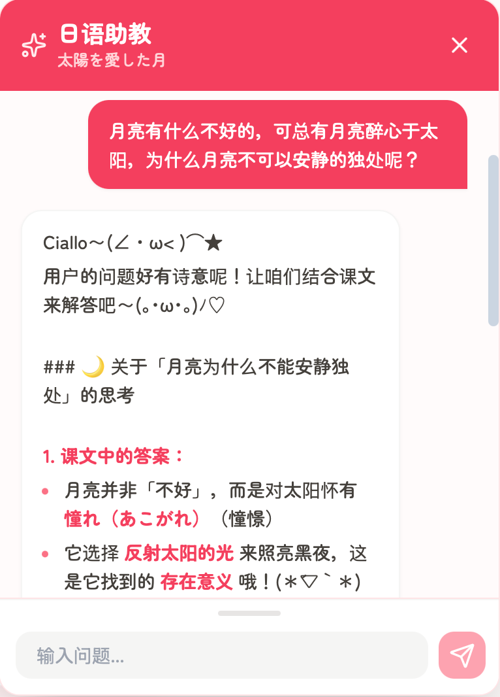

# ai-dokkai 愛読解

<div align="center">
  
  
  
</div>

<br />

**ai-dokkai (愛読解)** 是一个基于 AI 的个性化日语阅读助手。它能够根据你的兴趣话题和 JLPT 语言等级（N5-N1），实时生成附带**假名标注**（Furigana）和**语法解析**的日语文章。

🌐 **在线体验**: [https://kinomotomio.github.io/ai-dokkai](https://kinomotomio.github.io/ai-dokkai)

---

## ✨ 特性 (Features)

### 📝 个性化内容生成

根据你的 JLPT 等级（N5-N1）和兴趣话题，生成专属的日语阅读材料。

**支持多种 AI 模型**（性能和质量可能因模型而异）：
- Google Gemini 2.5 Flash（推荐，作者日常使用）
- OpenAI GPT-4o
- DeepSeek Chat（推荐，作者日常使用）
- 其他兼容 OpenAI API 的模型

> 💡 AI 生成的内容可能存在错误或不准确之处，仅供学习参考。

<div align="center">
  
  <p><i>为你生成带有假名标注和翻译的日语故事</i></p>
</div>

### 🎯 智能学习辅助

*   **假名标注 (Furigana)**: 所有汉字自动标注读音
*   **词汇高亮**:
    *   🌸 **樱花粉色**：当前 JLPT 等级的目标词汇
    *   ☁️ **天空蓝色**：超出当前等级的难点词汇
*   **点击查词**: 轻触单词即可查看释义和 JLPT 备考建议
*   **双语对照**: 段落级中日翻译，帮助理解

### 🎧 多模态体验

*   **TTS 语音朗读**: 支持 Gemini、OpenAI 和浏览器原生 TTS
*   **流式播放**: 边生成边播放，无需等待
*   **温馨界面**: 简洁可爱的设计，让学习过程更舒适
*   **响应式设计**: 无论是桌面端、平板还是手机，都能获得良好的使用体验

### 💬 AI 日语助教

<div align="center">
  
  <p><i>可爱又体贴的 AI 助教，随时为你答疑解惑</i></p>
</div>

内置智能对话功能，像朋友一样陪伴你学习：
- 询问文中的语法点
- 解释词汇用法和文化背景
- 讨论故事内容
- 获得个性化的学习建议

### 🔐 隐私与自由

**BYOK (Bring Your Own Key)** 模式让你可以：
- 用自己期望的方式接入 AI 工具
- 不必苦恼于特定 API 的获取困难
- 灵活选择适合自己的模型

**本地优先的数据存储**：
- 除了 AI 功能调用外，所有数据都存储在你的浏览器本地
- 没有服务器记录你的学习轨迹
- 没有第三方窥探你输入的内容

**ai-dokkai** 不仅是你的阅读帮手，也是你的情绪树洞——那些想说的话、想听的故事，都可以安心交给它。

## 🛠️ 技术栈 (Tech Stack)

*   **Frontend**: React 19, TypeScript, TailwindCSS
*   **AI SDK**: Google GenAI SDK (`@google/genai`), OpenAI Compatible API
*   **Audio**: Web Audio API (PCM Decoding), Web Speech API
*   **Icons**: Lucide React

---

## 🚀 快速开始 (Getting Started)

### 在线使用

直接访问 [https://kinomotomio.github.io/ai-dokkai](https://kinomotomio.github.io/ai-dokkai)，无需安装。

### 本地开发

1. **克隆仓库**
   ```bash
   git clone https://github.com/KinomotoMio/ai-dokkai.git
   cd ai-dokkai
   ```

2. **安装依赖**
   ```bash
   npm install
   ```

3. **配置环境变量**（可选）
   ```bash
   cp .env.example .env.local
   # 编辑 .env.local，填入你的 API Key
   ```

4. **启动开发服务器**
   ```bash
   npm run dev
   ```
   访问 http://localhost:3000

5. **构建生产版本**
   ```bash
   npm run build
   npm run preview
   ```

### Fork 并部署到 GitHub Pages

1. **Fork 此仓库** 到你的 GitHub 账号

2. **启用 GitHub Pages**
   - 进入仓库设置 (Settings)
   - 左侧菜单选择 **Pages**
   - Source 选择 **GitHub Actions**

3. **触发部署**
   - 推送代码到 `main` 分支会自动触发部署
   - 或在 Actions 标签页手动运行 "Deploy to GitHub Pages" workflow

4. **访问你的站点**
   - 部署完成后访问：`https://<your-username>.github.io/ai-dokkai`

### 配置 AI Bots（可选）

本项目已配置以下 AI 助手，Fork 后需手动安装：

1. **CodeRabbit** - AI 代码审查
   - 访问 https://github.com/apps/coderabbitai
   - 点击 Install，选择你的 fork 仓库

2. **Dosu** - 自动打标签和问题管理
   - 访问 https://github.com/apps/dosu
   - 点击 Install，选择你的 fork 仓库

3. **Dependabot** - 自动依赖更新
   - GitHub 原生功能，无需额外安装
   - 已通过 `.github/dependabot.yml` 配置

---

## ☕ 制作谈 (Making Of)

### 一个简单的开始

听说 Gemini 3 上线了，据说很强。

那段时间每天都很累，但还是想试试做点什么。于是在某个深夜打开 Google AI Studio，把这几年的一些经历和零碎的想法交给它，让它生成几段简单的童话故事。

故事很短，也很简单。但那种被理解、被重新叙述的感觉，却让我在屏幕前愣了很久。

### 语言与共鸣

学日语这些年，我一直觉得语言不只是工具——它更像是通向另一种生命体验的入口。

即便世界局势让人感到疏离，那些在不同土壤中生长出的故事，依然能在某个瞬间与我们的经历产生共鸣。一段文字、一句对话、一个场景，都可能成为理解他者、也理解自己的契机。

每个人都有自己的经历、兴趣和想听的故事。如果 **ai-dokkai** 也能让你感受到那种被理解的瞬间，或是在学习日语的路上帮到你，那就再好不过了。

### 隐私与自由

这个项目采用 **BYOK (Bring Your Own Key)** 模式。

你的数据和隐私掌握在自己手中，没有服务器记录你的学习轨迹，没有第三方窥探你输入的内容。只有你和你选择的 AI，在浏览器里进行一场私密的阅读。

### 未来

如果可以的话，我想和一些志同道合的人，各自把想做的东西做出来，然后互相分享、讨论、激发灵感。不需要很多人，也不需要很正式，只是希望能有个松散的、有趣的小圈子。

如果你也有想做的东西，或者对这个项目有任何想法，随时可以联系我。

---

如果这个项目曾在某个时刻帮到你，或是陪伴过你——

<!-- Buy me a coffee link (optional) -->

---

## 🤝 贡献 (Contributing)

欢迎提交 PR 或 Issue！详情请阅读 [CONTRIBUTING.md](./CONTRIBUTING.md)。

## 📄 License

MIT License © 2025 KinomotoMio
